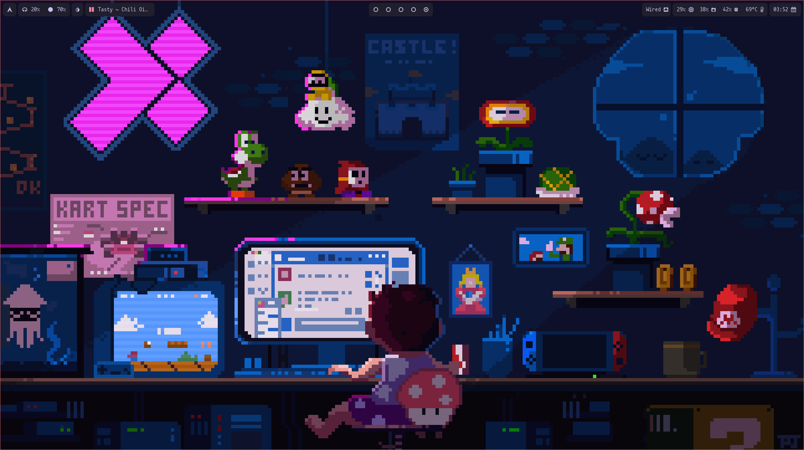
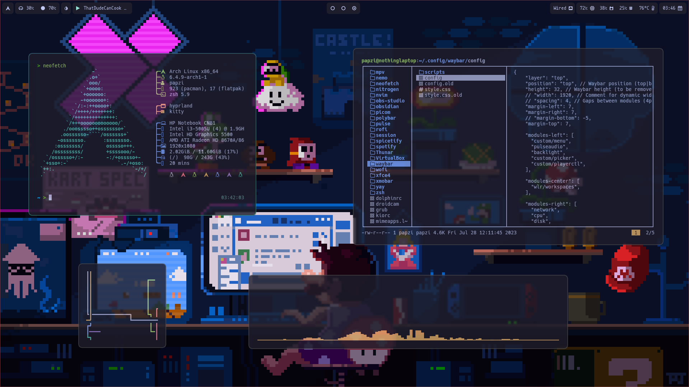
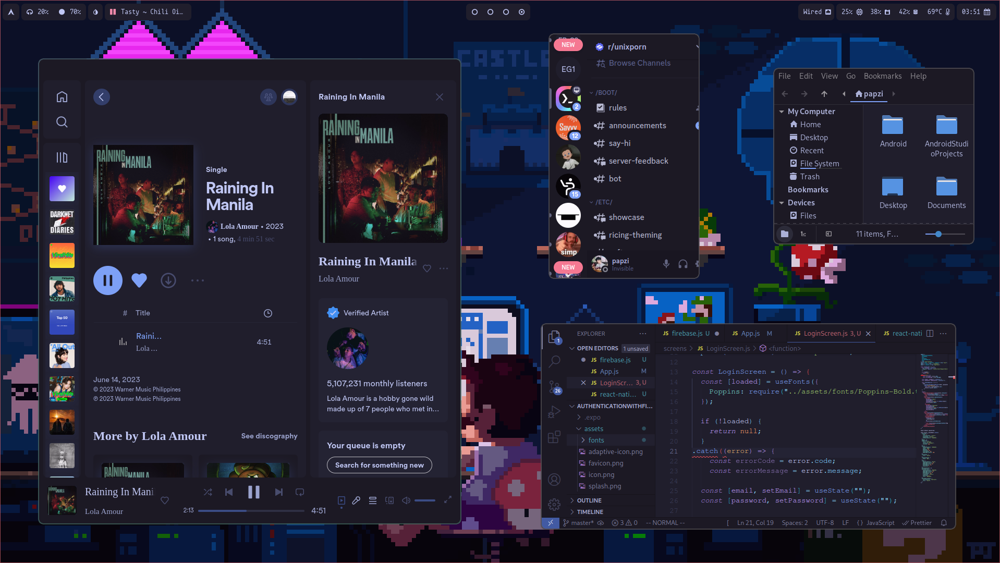

    <h1>My Dots</h1>

# What's in my rice?

- **OS**: arch
- **Window Manager**: hyprland
- **Terminal**: kitty
- **Shell**: zsh
- **Bar**: waybar
- **Color Scheme**: tokyo night
- **File Explorer (GUI)**: nemo
- **File Explorer (CLI)**: lf
- **Editor**: vscode
*my dots are not done yet...*

